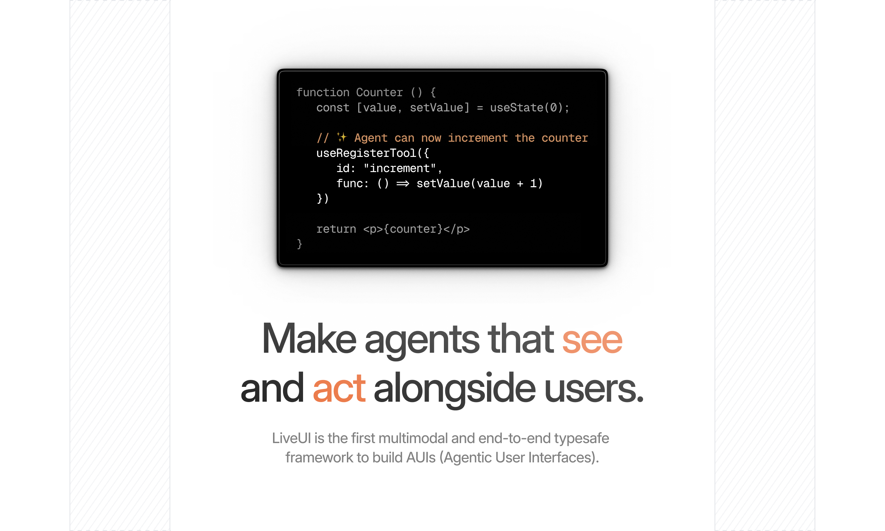

<p align="center">
    
</p>

<p align="center">
    
</p>

<h1 align="center">LiveUI</h1>
<p align="center"><b>The the first multimodal and end-to-end typesafe<br>framework to build AUIs (Agentic User Interfaces).</b></p>

<br>

<div align="center">
	
	<!--  -->
</div>

<br>
<br>
<br>

## Introduction
TODO

<br>
<br>

## Installation
1. Install dependencies with `npm` or equivalent:
```bash
npm install @liveui/server @liveui/client
```

2. TODO


## Usage
TODO

## Packages overview
- `@liveui/server`: LiveUI SDK core server-side utilities.
- `@liveui/client`: LiveUI SDK core browser-side utilities.
- `@liveui/react`: React hooks and components built on top of `@liveui/client`.
- `@liveui/shared`: Code and types shared between server and client packages.